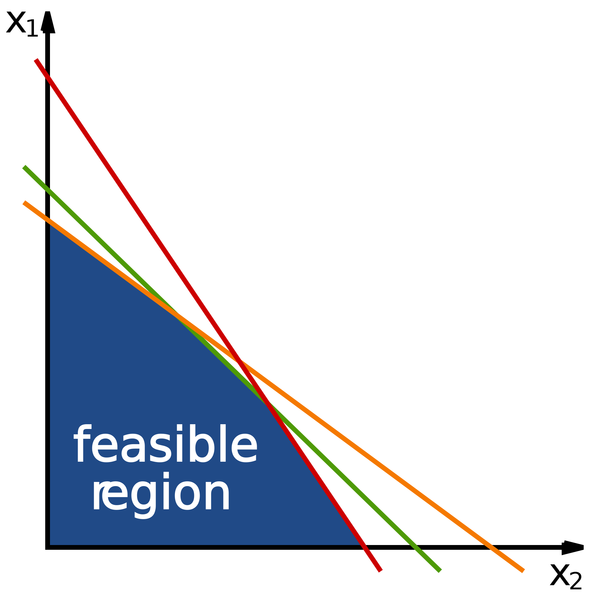

# Two-dimensional batch linear programming on the GPU

## Description
A high-performance, graphical processing unit-based algorithm for efficiently solving two-dimensional linear programs in batches. The domain of two-dimensional linear programs is particularly useful due to the prevalence of relevant geometric problems. Batch linear programming refers to solving numerous different linear programs within one operation. By solving many linear programs simultaneously and distributing workload evenly across threads, graphical processing unit utilization can be maximized. Speedups of over 22 times and 63 times are obtained against state-of-the-art graphics processing unit and CPU linear program solvers, respectively.

2-D linear problems are sets of equations of the form $ax + by < c$ with a function to maximise/minimise of the form $ix + jy$.

## Requirements
* x64 CPU architecture
* Nvidia GPU with compute capability > 30 (most GPUs from 2013 onwards)
* Cuda 8.0 compiler or later.
* Some form of C compiler.

## Software
Source code is freely available from [Github](https://github.com/coolmule0/LP)

## Publication
"Two-Dimensional Batch Linear Programming on the GPU"

Journal of Parallel and Distributed Computing

April 2019 [https://doi.org/10.1016/j.jpdc.2019.01.001](https://doi.org/10.1016/j.jpdc.2019.01.001)

[PDF available here](https://coolmule0.github.io/manuscripts/Two_Dimensional_Batch_Linear_Programming_Post-accept.pdf)

[Full published text avaiable until March 15th](https://authors.elsevier.com/a/1YSA5_GwHPIx5-)
